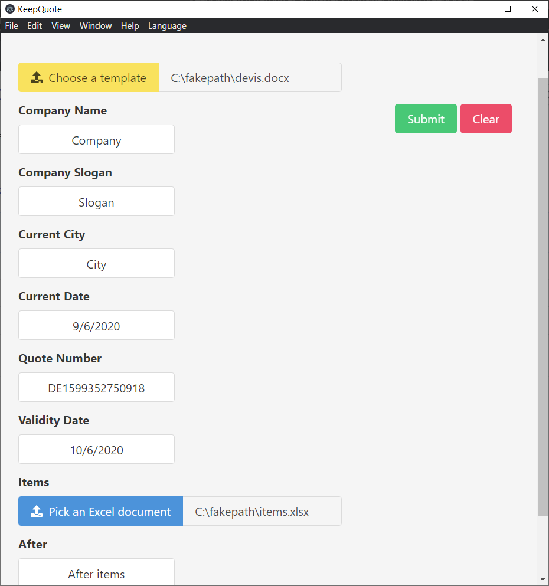

# KeepQuote

A small desktop application to help create quotation.

## Usage

* Choose a template to start creating your quote.
You can learn how to write them at [docx-templates github wiki](https://github.com/guigrpa/docx-templates#supported-commands). The link is accessible in the Help section of the application.
Default are provided in the [templates directory on github](https://github.com/TiphaineLAURENT/KeepQuote/tree/1.0.0/src/resources/templates).

* You can know fill the fields discovered from your template. By default, if your template contains the current_date, validity_date or quote_number parameters, the are automatically defaulted to:
  * current_date: Current date to locale date string (06/09/2020)
  * validity_date: Current date + 1 month to locale date string (06/10/2020)
  * quote_number: Milliseconds since the UNIX Epoch prefixed by DE (DE1599347853353)

* When you are done, click Submit and save your quote.
